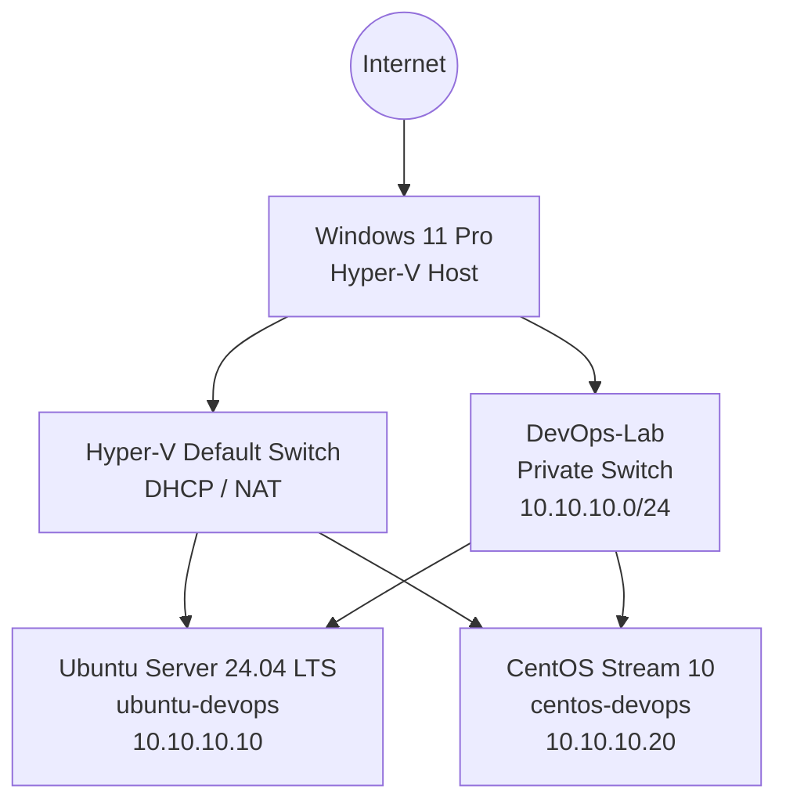

# Lab Architecture

## Overview

This project is a local DevOps and platform engineering environment running on Microsoft Hyper-V.

Two Linux virtual machines are currently deployed:

- Ubuntu Server 24.04 LTS
- CentOS Stream 10

Each VM uses two network interfaces.

## Network Architecture

## Virtual Machines

| System | Purpose | Lab Address |
|---|---|---|
| Ubuntu Server | Administration and future automation/control node | `10.10.10.10/24` |
| CentOS Stream | Managed Linux server and Red Hat-family learning environment | `10.10.10.20/24` |

## Network Interfaces

Each virtual machine has two virtual NICs.

### NIC 1 — External Connectivity

Connected to:

`Hyper-V Default Switch`

Purpose:

- DHCP address assignment
- Internet access
- Package downloads
- SSH access from the Windows host

### NIC 2 — DevOps Lab Network

Connected to:

`DevOps-Lab`

Purpose:

- Stable private addresses
- Linux-to-Linux communication
- SSH
- Ansible
- Future services and containers
- Future monitoring
- Kubernetes experimentation

The private network is:

`10.10.10.0/24`

Ubuntu:

`10.10.10.10`

CentOS:

`10.10.10.20`

Neither private interface has a default gateway. Internet traffic continues to use the Default Switch interface.

## Design Goal

Separating external connectivity from lab traffic provides predictable addressing while keeping the DevOps environment logically separated from internet-facing connectivity.
